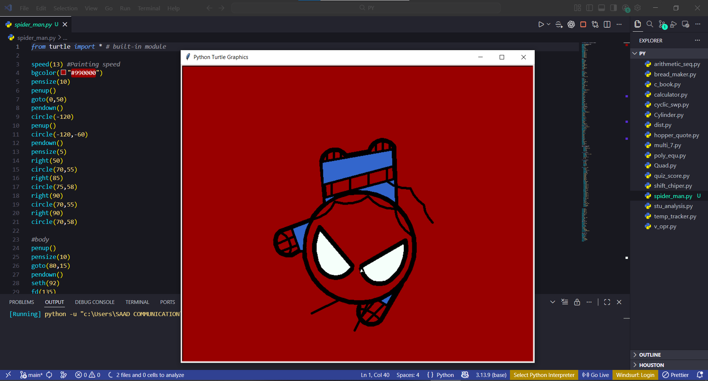

# 🕷️ Spider-Man Drawing with Python Turtle

A fun Python project that draws a **Spider-Man inspired face using the Turtle Graphics library**.

This project demonstrates how simple geometric shapes and turtle movements can be combined to create creative visual art using Python.

---

## 📸 Preview

---

## 🚀 Features

- Built using **Python Turtle Graphics**
- Uses geometric shapes like **circles and curves**
- Demonstrates use of:
  - `circle()`
  - `fd()`
  - `goto()`
  - `penup()` / `pendown()`
  - `seth()` (set heading)
- Custom background color
- Creative drawing using mathematical positioning

---

## 🛠️ Technologies Used

- **Python 3**
- **Turtle Graphics Library**
- **VS Code**

---

## ▶️ How to Run

1. Install Python

2. Clone the repository

3. Run the program

A window will open and the **Spider-Man drawing animation will start.**

---

## 📚 What I Learned

- Working with **Python Turtle Graphics**
- Creating drawings using **mathematical positioning**
- Understanding **angles, arcs, and coordinate systems**
- Turning programming into **creative visual art**

---

## 🎯 Future Improvements

- Add animation
- Draw full Spider-Man body
- Export drawing as image
- Convert to interactive drawing

---

## 👨‍💻 Author

**Taimoor Khan**

Full Stack Developer  
React • Next.js • Node.js • TypeScript • Python

---

⭐ If you like this project, feel free to star the repo!
